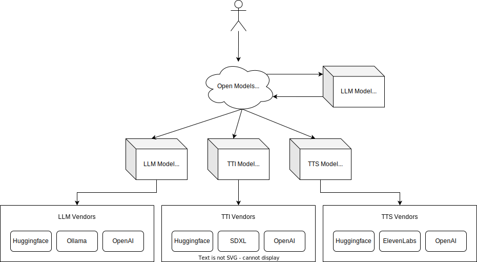

# Open Models: Your Gateway to AI Conversations 🌟

---

## Welcome to "Open Models" - Unleash the Power of AI! 🚀

"Open Models" is an innovative AI chatbot platform that seamlessly integrates various AI capabilities into a single conversational interface. It's not just a chatbot; it's your gateway to experiencing the future of AI interaction!

### Features:

- **Text-to-Image (TTI)** 🎨: Visualize your thoughts! Ask the AI to create an image, and watch as your words transform into stunning visuals.

- **Text-to-Speech (TTS)** 🎙️: Bring your text to life! Request audio and listen to the AI eloquently speak out your words.
- **Large Language Model (LLM)** 💬: Need answers or ideas? Have a regular chat with the AI and let it amaze you with its depth of knowledge and creativity.

### How It Works:

1. **Talk to the AI**: Start a conversation. It's as simple as chatting with a friend.
2. **Make a Request**: Want an image, audio, or an answer? Just ask!
3. **AI in Action**: Behind the scenes, the AI triggers the specific model needed - TTI, TTS, or LLM - to fulfill your request.

### Why "Open Models"?

- **Innovative Technology**: Cutting-edge AI at your fingertips.
- **User-Friendly**: Intuitive and fun to use for everyone.
- **Versatile**: From education to entertainment, the possibilities are endless.

---

## 🌈 Get Involved!

We're on a mission to make AI accessible and exciting for all. Here's how you can be a part of this journey:

- **Subscribe to Devspot on YouTube** 📺: Catch the latest updates and tutorials [here](https://www.youtube.com/@Dev-Spot).
- **Join Our Newsletter** 📰: Stay ahead of the curve with our [newsletter](https://devspot.beehiiv.com/subscribe). Get tips, insights, and exclusive content!

---

## 🤝 Contributing:

Your ideas and contributions can help shape the future of "Open Models"! Whether you're a developer, designer, or an AI enthusiast, we welcome your input.

- **GitHub Repository**: Found a bug or have a feature suggestion? Open an issue or submit a pull request.
- **Community Support**: Join our community discussions. Share your experiences and learn from others.

---

## 📚 Documentation:

For detailed instructions and documentation, please visit our [GitHub repository](#).

---

## 📣 Let's Make AI Conversations Amazing Together!

Join us in this exciting journey. Explore, experiment, and express with "Open Models" - your playground for AI interaction!

---

🔗 **Stay Connected**: Don't forget to follow us on social media for the latest news and updates!

"Open Models" - Powered by imagination, driven by AI. 🌐✨